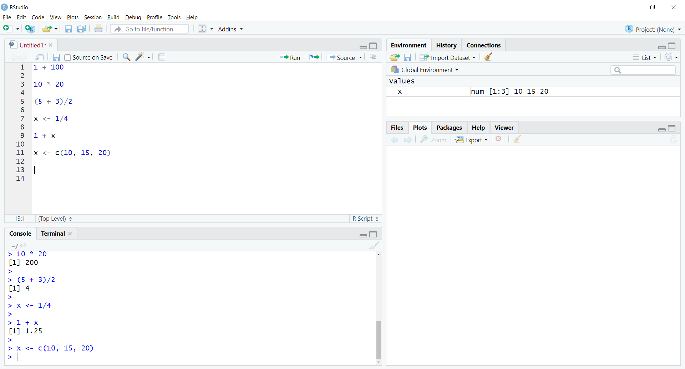

<form>
    <button 
      style="background-color:#159061;color:white;width:150px;
      height:40px" type="submit" formaction="#steps">Workshop Preparation</button>
    <button 
      style="background-color:#159061;color:white;width:143px;
      height:40px" type="submit" formaction="#start">R & RStudio Setup</button>
    <button 
      style="background-color:#159061;color:white;width:143px;
      height:40px" type="submit" formaction="#intro">Introduction to R</button>
    <button 
      style="background-color:#159061;color:white;width:143px;
      height:40px" type="submit" formaction="Intro_R.html">Pre-workshop</button>
    <button 
      style="background-color:#159061;color:white;width:143px;
      height:40px" type="submit" formaction="Power-Analysis.html">Power Analysis</button>

</form>


It is impossible to be an expert in all aspects of science, mathematics, statistics, business, communication, psychology and all the other myriad skills necessary to solve complex problems in the real world. UConn's Statistical Consulting Services aims to bridge the gap between statisticians and domain experts from across disciplines at UConn and across Connecticut. We provide statistical support in the form of [consultations](https://statsconsulting.uconn.edu/), seminars and workshops. 

### Aims of this workshop series
The aims of this workshop series are to (i) introduce participants to statistical tools available in R, (ii) promote the use of R by participants in their own work and research, and (iii) promote reproducible research through making all code and workshop content freely available to all participants. 

### What's on this page
This page is going to guide you through **steps to take** to prepare for the upcoming workshops. The primary goals are to: \newline

1. Have each participant ready to use R and Rstudio, and \newline
2. Provide practical tips on how to prepare for the workshops. \newline

### Workshop Survey
Before participating in one of our workshops please [register here](https://statsconsulting.uconn.edu/workshop-schedule/) (you do not need to register again if you have already), and complete our [pre-workshop survey](https://docs.google.com/forms/d/e/1FAIpQLSfMo0TcrzJGHsD57B9HhABmpXL-GoH5yQAHC0CufJp7HGSCaw/viewform?usp=sf_link). This **survey** is a valuable tool, allowing us to ensure that you get the most out of our workshops.  


### Live Coding
Similar to a [Software or Data Carpentry workshop](https://carpentries.org/), instructors will work through the workshop with participants, typing in the code, reformatting data, and talking as we go. This is called “live coding”. However, the instructor is not live coding in a vacuum. Importantly, participants are strongly encouraged to “code-along” with the instructor. We refer to the practice of having the instructor live code and the learners code along as “participatory live coding” or, less formally, ‘code-along sessions’. For some suggestions on how to format you screen, see [below](#during).

---

## Workshop Preparation{#steps} 
### Before the workshop{#before}
1. Complete our [pre-workshop survey](https://docs.google.com/forms/d/e/1FAIpQLSfMo0TcrzJGHsD57B9HhABmpXL-GoH5yQAHC0CufJp7HGSCaw/viewform?usp=sf_link)
2. Make sure that you have downloaded and installed R and Rstudio
3. Work through the introduction to R and Rstudio section on this page
4. Install the packages listed in the [Installing & loading packages](#packages)
5. Ensure that you are comfortable opening an R script and loading packages
6. Check that you are able to access and operate [WebEx](https://confluence.uconn.edu/ikb/communication-and-collaboration/webex-video-conferencing/hosting-or-joining-a-webex-meeting) 
7. If you have any questions/issues please schedule an appointment with one of the SCS consulants, [available here](https://statsconsulting.uconn.edu/walk-in-schedule/), or email [timothy.e.moore@uconn.edu](mailto:timothy.e.moore@uconn.edu)


### During the workshop{#during}
1. Sign in on our registration form.
2. It is hard to keep track of everything on your screen, especially if you only have a single monitor. If you are in this situation, we recommend having as few programs open on your screen as possible. We recommend splitting your layout so that you have your Rstudio session on one side of your screen, and WebEx on the other side of the screen:


### After the workshop{#after}
1. Let us know how we did! Please complete our [post-workshop survey](https://docs.google.com/forms/d/e/1FAIpQLSfaUs9ibczmT_7Wsm_6-gLK7YWS4WlpcWC6unJ7fBINNH-5Rw/viewform?usp=sf_link)
2. Reach out to [timothy.e.moore@uconn.edu](mailto:timothy.e.moore@uconn.edu) if you have any questions, or recommendations for future workshops. 

---

## Getting started with R and Rstudio{#start}

### Installing R and Rstudio
#### Windows
Install **R** by downloading and running [this .exe](https://cran.r-project.org/bin/windows/base/release.htm) file from [CRAN](https://cran.r-project.org/index.html). Also, please install the **RStudio** [IDE](https://www.rstudio.com/products/rstudio/download/#download). Note that if you have separate user and admin accounts, you should run the installers as administrator (right-click on .exe file and select "Run as administrator" instead of double-clicking). Otherwise problems may occur later, for example when installing R packages.

#### MacOS
Install **R** by downloading and running [this .pkg file](https://cran.r-project.org/bin/macosx/R-latest.pkg) from [CRAN](https://cran.r-project.org/index.html). Also, please install the **RStudio** [IDE](https://www.rstudio.com/products/rstudio/download/#download).

#### Linux
You can download the binary files for your distribution from CRAN. Or you can use your package manager (e.g. for Debian/Ubuntu run 'sudo apt-get install r-base' and for Fedora run 'sudo dnf install R'). Also, please install the **RStudio** [IDE](https://www.rstudio.com/products/rstudio/download/#download).

* **Note for the power analysis workshops:** Install **G*Power** by following the links on [this page](https://www.psychologie.hhu.de/arbeitsgruppen/allgemeine-psychologie-und-arbeitspsychologie/gpower.html), depending on your native OS.

### A brief intro to R and Rstudio
*This content has been adapted from a [Carpentries](https://carpentries.org/) lesson. For more detail visit [this website](https://swcarpentry.github.io/r-novice-gapminder/01-rstudio-intro/).


#### What is Rstudio?
Rstudio is a free, open source R Integrated Development Environment (IDE). It provides a built in editor, works on all platforms (including on servers) and provides many advantages such as integration with version control (e.g., git) and project management. Essentially, it is the interface we will use to communicate with R. 

#### Basic layout of RStudio
When you first open RStudio, you will be greeted by three panels:

* The interactive R console/Terminal (entire left)
* Environment/History/Connections (tabbed in upper right)
* Files/Plots/Packages/Help/Viewer (tabbed in lower right):


One option for working in **Rstudio** would be to write all of our R commands directly into the *console*. One of the benefits of **Rstudio**, though is that we can store all of our commands in a document, or _script_, which we can then share with collaborators or publish along with our research. In fact, we can use documents generated in **R** and **Rstudio** to build webpages (like this one!). 

To open a new _R script_ go to File > New File > R Script. Now, the **Rstudio** window should have four panels, like this:


All of you code can now be written in this script and saved on your computer for later. Next we will run through some basics of R syntax. 

### Introduction to R{#intro}
Now that we have opened a new R script, we can begin writing commands and sending them to R to be executed. Each line of code that we run will be printed in the console, next to the '>'. R will then evaluate the command and try to execute it. Some of the simplest commands are for using R like a calculator. For example, type '1 + 100' into your R script.


```r
1 + 100
```


Right now, the command only exists in the R script and has not been sent to R. There are two main ways of sending commands from your R script to R:

* By placing your cursor on the line you want to run and clicking on the 'run' button on the top right-hand side of the script pane:


* Alternatively, you can use either 'Cmd + Enter' (on a Mac), or 'Ctrl + Enter' (on a Windows machine) to execute the line that your cursor is on. 

Once you have run the command you should see the command, and R's response, show up in the Console pane:


Here, R has evaluated your command, and executed the arithmetic and output the result. 

You can also highlight multiple lines in your R script and run them simultaneously, using one of the options above:


```r
1 + 100

10*20

(5+3) / 2
```


In this case, R has executed all three commands, and output the results in the order they appeared in your R script. 

##### Storing values in variables
We can store values in variables using the assignment operator '<-', like this:


```r
x <- 1/4
```

Now, we will see that an object 'x' has appeared in our environment tab. 


We have essentially stored the number `0.25` in the object 'x'. We can now execute any commands on 'x' that expect a number:


```r
1 + x
```


We can store multiple values in an object, for example:


```r
x <- c(10, 15, 20)
```


(notice that we have now overwritten the previous value of 'x')

We can now perform functions on the object x, for example, arithmetic:


```r
x + 5
```


Or more advanced functions, like calculating the mean:


```r
mean(x)
```


##### Installing & loading packages{#packages}
So far, the arithmetic and other functions (like `mean()`) we have used are built into base R. There are many functions that have been developed to perform statistical analysis, data manipulations, and data visualizations and these are stored in stand-alone **packages**. Essentially these packages are collections of functions (to use a Harry Potter analogy: packages are the spell books and functions are spells). We will use a number of these packages in this workshop. We encourage all participants to install these prior to attending the workshops. 

There are 2 steps to using packages in R: i) installing them onto your machine, and ii) loading them into your R session.

For the first step, you can use the `install.packages` function. For these workshops, we will install serveral packages. To begin, install `ggplot2`:


```r
install.packages("ggplot2")
```


You can check which packages you have loaded by typing `installed.packages()`. Once you have installed a package, it will not need to be installed again.


```r
installed.packages()
```

To make the packages available to in the current session, you need to use the `library()` function. Note this will only work on installed packages. You will need to load packages each time you start a new Rstudio session. 


```r
library(ggplot2)
```


Some very useful packages that we recommend you install prior to attending our workshops inlcude: \newline

* ggplot2 \newline
* AMR \newline
* dplyr \newline 
* cowplot \newline
* gridExtra \newline
* corrplot \newline
* GGally \newline
* sjPlot \newline


### Annotation in your R script
It is very important to be able to annotate your scripts. This is so that when you return to a script after a few months (or years!), you can have reminders of what you did, and why you did it. Annotation in R is done with the '#'. Bt default, annotations, or **comments**, will become green in your script. Here's an example. 


```r
# load libraries
library(ggplot2)

# load data
data(diamonds)

# generate plot
ggplot(data = diamonds, 
       mapping = aes(x = caret, color = cut)) + # call a plot, add aesthetics
  geom_freqpoly(lwd = 1.1) + # specify type of plot and line width
  xlim(c(0, 3)) # set limits of x-axis
```


Notice that this code includes 'in-line comments', where comments have been placed on the same line as the code. This is extremely useful when sharing new code with colleagues and collaborators. 

#### Saving R script
If you would like to keep all of the code you have written, you can now safe this file (File > Save), and reopen it the next time you need it. You could also then share you script (along with your data) with collaborators via email, or collaborative software, like [github](https://github.com/).


--- 

## About the SCS{#about}

The [Statistical Consulting Services](https://statsconsulting.uconn.edu/) (SCS) provides advice on statistical problems arising in the preparation of studies, the analysis of data and the interpretation of results. The SCS is available to graduate students, faculty members, as well as non-UConn clients in government and industry. The SCS provides statistical advice to faculty and graduate student researchers throughout the University generating collaborative research and serving to train graduate students in applied statistics. We can assist with: 

* Design of Experiments and Surveys
* Interpretation of Results
* Preparation of Proposals/ Grants
* Statistical Software Issues
* Data Analysis and Modeling

\newline
We have 3 primary modes of consultation: [walk-in](https://statsconsulting.uconn.edu/walk-in-schedule/), [online](https://statsconsulting.uconn.edu/ask-online/), and [full project engagement](https://statsconsulting.uconn.edu/project-engagement/). Walk-in and online consultations are geared towards short, one-and-done type meetings, whereas full project engagements are designed for longer-term collaborative projects. Please feel free to [reach out](mailto:timothy.e.moore@uconn.edu) if you have questions. 

